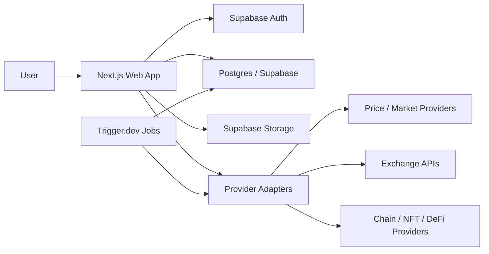
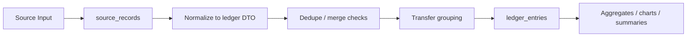

# DCAlytics Build Spec

This document turns the high-level roadmap into an implementation-oriented build spec for the next version of DCAlytics.

The current repository is still a static prototype. The next step is not to keep stretching that prototype forever. The next step is to rebuild DCAlytics as a proper web application with a shared domain model that can later support iOS and Android clients.

## 1. Product Direction

Primary direction:

- Web app first
- Mobile-ready architecture from day one
- iOS and Android clients later, built on the same backend and domain model
- Unified portfolio tracking across manual entries, wallet addresses, TXIDs, and exchange sync
- Local-first capable architecture, with optional sync instead of forced cloud-only behavior

Product principles:

- A portfolio is the main user workspace
- A user can own multiple portfolios
- Every data source normalizes into a single ledger
- Transfers between owned sources should not count as fresh gains twice
- Exchange integrations must stay read-only
- Provider integrations must be adapter-based, not hard-wired

## 2. Recommended Stack

Core stack:

- Monorepo: Turborepo
- Web app: Next.js App Router + TypeScript
- Styling: Tailwind CSS + CSS variables + shared UI package
- Client data layer: TanStack Query
- Validation: Zod
- Backend: Supabase
- Database: Postgres via Supabase
- Auth: Supabase Auth
- File storage: Supabase Storage
- Background jobs: Trigger.dev
- Mobile later: Expo / React Native
- Internationalization later: next-intl

Why this stack:

- Next.js gives a strong web app base and a clean path for authenticated dashboards
- Supabase covers auth, database, storage, and row-level security without forcing us to build backend plumbing from scratch
- Trigger.dev is a good fit for sync jobs, imports, backfills, alerts, and de-dup passes
- Expo gives us a realistic later path to iOS and Android without rebuilding the entire product model

## 3. Target Monorepo Layout

```text
dcalytics/
  apps/
    web/
      app/
      components/
      lib/
      public/
      styles/
    mobile/
    jobs/
  packages/
    ui/
    domain/
    db/
    auth/
    providers/
    ledger/
    crypto/
    i18n/
    config/
  docs/
    BUILD_SPEC.md
```

Package responsibilities:

- `packages/ui`: shared design system, tokens, charts, tables, form components
- `packages/domain`: shared types, enums, DTOs, business rules
- `packages/db`: schema, migrations, SQL helpers, typed query wrappers
- `packages/auth`: auth guards, session helpers, role checks
- `packages/providers`: CoinGecko, chain explorers, NFT providers, exchange adapters
- `packages/ledger`: normalization, dedupe, transfer grouping, portfolio aggregation
- `packages/crypto`: encryption helpers for local-first mode and secrets
- `packages/i18n`: message files and locale helpers
- `packages/config`: env validation and shared runtime config

## 4. Application Modules

Main product modules:

1. Authentication
2. Portfolio management
3. Manual transactions
4. Import and export
5. Asset catalog and chain catalog
6. Unified ledger
7. Wallet tracking
8. Exchange sync
9. Price service
10. NFT tracking
11. DeFi positions
12. Alerts
13. Share links
14. AI analyst

Phase 1 only needs modules 1 to 6 fully active.

## 5. System Architecture

High-level architecture:



Key rule:

- All ingestion sources eventually become normalized `ledger_entries`

Sources that feed the ledger:

- manual form entry
- CSV / JSON import
- TXID import
- public wallet address sync
- read-only exchange sync

## 6. Data Model Strategy

We should not model separate disconnected systems for manual trades, wallets, and exchanges. We should model one unified ledger from the start.

Core data concepts:

- `portfolio`: the user workspace
- `source_record`: the raw or near-raw record from a source
- `ledger_entry`: the normalized financial event used for totals and history
- `transfer_group`: a link between entries that represent one internal transfer

This allows:

- one combined history
- proper de-duplication
- transfer detection
- future support for NFTs and DeFi without replacing the core

## 7. Exact Database Tables

This section focuses on the practical schema we should start with. Some tables are `Phase 1 required`, and some are `Phase 2 ready but can be created early`.

General conventions:

- primary keys use `uuid default gen_random_uuid()`
- times use `timestamptz`
- money and quantity use `numeric(38, 18)`
- JSON payloads use `jsonb`
- user auth identity lives in `auth.users`

### 7.1 Phase 1 Required Tables

#### `profiles`

Purpose:

- application profile metadata for each authenticated user

Columns:

```sql
create table profiles (
  id uuid primary key references auth.users(id) on delete cascade,
  display_name text,
  default_locale text not null default 'en',
  default_currency text not null default 'usd',
  created_at timestamptz not null default now(),
  updated_at timestamptz not null default now()
);
```

#### `portfolios`

Purpose:

- a user can have many portfolios, such as long-term, trading, or experimental

Columns:

```sql
create table portfolios (
  id uuid primary key default gen_random_uuid(),
  owner_user_id uuid not null references auth.users(id) on delete cascade,
  name text not null,
  base_currency text not null default 'usd',
  description text,
  color_tag text,
  is_archived boolean not null default false,
  created_at timestamptz not null default now(),
  updated_at timestamptz not null default now()
);

create index portfolios_owner_user_id_idx on portfolios(owner_user_id);
```

#### `portfolio_members`

Purpose:

- supports future collaboration and read-only access without redesign

Columns:

```sql
create table portfolio_members (
  id uuid primary key default gen_random_uuid(),
  portfolio_id uuid not null references portfolios(id) on delete cascade,
  user_id uuid not null references auth.users(id) on delete cascade,
  role text not null check (role in ('owner', 'editor', 'viewer')),
  created_at timestamptz not null default now(),
  unique (portfolio_id, user_id)
);

create index portfolio_members_user_id_idx on portfolio_members(user_id);
```

#### `chains`

Purpose:

- normalized chain directory for manual add, wallet tracking, and token contracts

Columns:

```sql
create table chains (
  id uuid primary key default gen_random_uuid(),
  slug text not null unique,
  name text not null,
  family text not null check (family in ('bitcoin', 'evm', 'solana', 'cosmos', 'other')),
  native_symbol text,
  chain_reference text,
  is_active boolean not null default true,
  created_at timestamptz not null default now()
);
```

#### `assets`

Purpose:

- canonical asset directory independent from one single provider

Columns:

```sql
create table assets (
  id uuid primary key default gen_random_uuid(),
  symbol text not null,
  name text not null,
  asset_type text not null check (asset_type in ('coin', 'token', 'nft', 'lp_token', 'other')),
  coingecko_id text,
  is_active boolean not null default true,
  created_at timestamptz not null default now(),
  updated_at timestamptz not null default now()
);

create index assets_symbol_idx on assets(symbol);
create index assets_coingecko_id_idx on assets(coingecko_id);
```

#### `asset_deployments`

Purpose:

- chain-specific deployment or listing data for an asset

Columns:

```sql
create table asset_deployments (
  id uuid primary key default gen_random_uuid(),
  asset_id uuid not null references assets(id) on delete cascade,
  chain_id uuid references chains(id) on delete cascade,
  contract_address text,
  decimals integer,
  provider_symbol text,
  provider_name text,
  is_native boolean not null default false,
  is_active boolean not null default true,
  created_at timestamptz not null default now(),
  unique (asset_id, chain_id, contract_address)
);

create index asset_deployments_asset_id_idx on asset_deployments(asset_id);
create index asset_deployments_chain_id_idx on asset_deployments(chain_id);
```

#### `asset_aliases`

Purpose:

- search aliases for coin lookup and future provider matching

Columns:

```sql
create table asset_aliases (
  id uuid primary key default gen_random_uuid(),
  asset_id uuid not null references assets(id) on delete cascade,
  alias text not null,
  alias_kind text not null check (alias_kind in ('name', 'symbol', 'slug', 'provider')),
  unique (asset_id, alias, alias_kind)
);

create index asset_aliases_alias_idx on asset_aliases(alias);
```

#### `source_records`

Purpose:

- raw ingestion records before or alongside normalization

Columns:

```sql
create table source_records (
  id uuid primary key default gen_random_uuid(),
  portfolio_id uuid not null references portfolios(id) on delete cascade,
  source_type text not null check (source_type in ('manual', 'import', 'txid', 'wallet', 'exchange')),
  source_provider text,
  external_id text,
  fingerprint text,
  raw_payload jsonb not null default '{}'::jsonb,
  observed_at timestamptz,
  created_by_user_id uuid references auth.users(id) on delete set null,
  created_at timestamptz not null default now(),
  unique (portfolio_id, source_type, source_provider, external_id)
);

create index source_records_portfolio_id_idx on source_records(portfolio_id);
create index source_records_fingerprint_idx on source_records(fingerprint);
```

#### `ledger_entries`

Purpose:

- normalized ledger rows used across dashboard, history, charts, and future sync

Columns:

```sql
create table ledger_entries (
  id uuid primary key default gen_random_uuid(),
  portfolio_id uuid not null references portfolios(id) on delete cascade,
  source_record_id uuid references source_records(id) on delete set null,
  chain_id uuid references chains(id) on delete set null,
  asset_id uuid not null references assets(id) on delete restrict,
  entry_type text not null check (
    entry_type in (
      'buy',
      'sell',
      'transfer_in',
      'transfer_out',
      'income',
      'fee',
      'adjustment'
    )
  ),
  quantity numeric(38, 18) not null,
  unit_price numeric(38, 18),
  gross_value numeric(38, 18),
  fee_value numeric(38, 18) not null default 0,
  fee_asset_id uuid references assets(id) on delete set null,
  currency_code text not null default 'usd',
  tx_hash text,
  external_ref text,
  notes text,
  transfer_group_id uuid,
  dedupe_hash text,
  occurred_at timestamptz not null,
  created_by_user_id uuid references auth.users(id) on delete set null,
  created_at timestamptz not null default now(),
  updated_at timestamptz not null default now()
);

create index ledger_entries_portfolio_occurred_idx on ledger_entries(portfolio_id, occurred_at desc);
create index ledger_entries_asset_id_idx on ledger_entries(asset_id);
create index ledger_entries_transfer_group_id_idx on ledger_entries(transfer_group_id);
create index ledger_entries_dedupe_hash_idx on ledger_entries(dedupe_hash);
```

#### `imports`

Purpose:

- track CSV / JSON import sessions and outcomes

Columns:

```sql
create table imports (
  id uuid primary key default gen_random_uuid(),
  portfolio_id uuid not null references portfolios(id) on delete cascade,
  uploaded_by_user_id uuid references auth.users(id) on delete set null,
  file_name text not null,
  file_type text not null check (file_type in ('csv', 'json')),
  status text not null check (status in ('uploaded', 'parsed', 'validated', 'completed', 'failed')),
  row_count integer not null default 0,
  success_count integer not null default 0,
  error_count integer not null default 0,
  storage_path text,
  error_summary text,
  created_at timestamptz not null default now(),
  completed_at timestamptz
);

create index imports_portfolio_id_idx on imports(portfolio_id);
```

#### `import_rows`

Purpose:

- preserve row-level validation and mapping results

Columns:

```sql
create table import_rows (
  id uuid primary key default gen_random_uuid(),
  import_id uuid not null references imports(id) on delete cascade,
  row_number integer not null,
  raw_payload jsonb not null default '{}'::jsonb,
  normalized_payload jsonb not null default '{}'::jsonb,
  status text not null check (status in ('pending', 'accepted', 'rejected')),
  message text,
  created_at timestamptz not null default now(),
  unique (import_id, row_number)
);

create index import_rows_import_id_idx on import_rows(import_id);
```

### 7.2 Phase 2 Ready Tables

#### `wallet_addresses`

```sql
create table wallet_addresses (
  id uuid primary key default gen_random_uuid(),
  portfolio_id uuid not null references portfolios(id) on delete cascade,
  chain_id uuid not null references chains(id) on delete restrict,
  address text not null,
  label text,
  ownership_type text not null default 'owned' check (ownership_type in ('owned', 'watched')),
  is_active boolean not null default true,
  created_at timestamptz not null default now(),
  unique (portfolio_id, chain_id, address)
);
```

#### `exchange_connections`

```sql
create table exchange_connections (
  id uuid primary key default gen_random_uuid(),
  portfolio_id uuid not null references portfolios(id) on delete cascade,
  exchange_slug text not null,
  label text,
  status text not null check (status in ('active', 'paused', 'error')),
  read_only boolean not null default true,
  created_at timestamptz not null default now(),
  updated_at timestamptz not null default now()
);
```

#### `sync_runs`

```sql
create table sync_runs (
  id uuid primary key default gen_random_uuid(),
  portfolio_id uuid references portfolios(id) on delete cascade,
  target_type text not null check (target_type in ('wallet', 'exchange', 'prices', 'nft', 'defi')),
  target_id uuid,
  status text not null check (status in ('queued', 'running', 'completed', 'failed')),
  started_at timestamptz,
  finished_at timestamptz,
  result_summary jsonb not null default '{}'::jsonb,
  error_message text,
  created_at timestamptz not null default now()
);
```

#### `transfer_groups`

```sql
create table transfer_groups (
  id uuid primary key default gen_random_uuid(),
  portfolio_id uuid not null references portfolios(id) on delete cascade,
  status text not null check (status in ('suggested', 'confirmed', 'rejected')),
  reason text,
  created_at timestamptz not null default now(),
  confirmed_at timestamptz
);
```

#### `price_snapshots`

```sql
create table price_snapshots (
  id uuid primary key default gen_random_uuid(),
  asset_id uuid not null references assets(id) on delete cascade,
  currency_code text not null,
  price numeric(38, 18) not null,
  source_provider text not null,
  captured_at timestamptz not null,
  unique (asset_id, currency_code, source_provider, captured_at)
);
```

## 8. Row-Level Security Model

RLS rules:

- `profiles`: user can read and update only own profile
- `portfolios`: accessible if user is owner or member
- `portfolio_members`: accessible if user belongs to that portfolio
- all portfolio-scoped tables inherit access from `portfolio_members`
- future share links must use separate read-only tokens and must not bypass membership rules directly

Practical rule:

- every user-facing row should be anchored either to `user_id` or `portfolio_id`

## 9. API Modules

These should be implemented as Next.js route handlers or server actions, but the module boundaries should stay the same.

### 9.1 Auth Module

- `POST /auth/sign-up`
- `POST /auth/sign-in`
- `POST /auth/sign-out`
- `POST /auth/reset-password`
- `GET /me`

### 9.2 Portfolio Module

- `GET /api/portfolios`
- `POST /api/portfolios`
- `PATCH /api/portfolios/:portfolioId`
- `DELETE /api/portfolios/:portfolioId`
- `GET /api/portfolios/:portfolioId/summary`

### 9.3 Catalog Module

- `GET /api/catalog/chains`
- `GET /api/catalog/assets/search?q=&chain=`
- `GET /api/catalog/assets/:assetId`

### 9.4 Ledger Module

- `GET /api/portfolios/:portfolioId/ledger`
- `POST /api/portfolios/:portfolioId/ledger/manual`
- `PATCH /api/ledger/:entryId`
- `DELETE /api/ledger/:entryId`
- `GET /api/portfolios/:portfolioId/positions`

### 9.5 Import / Export Module

- `POST /api/portfolios/:portfolioId/imports`
- `GET /api/portfolios/:portfolioId/imports`
- `GET /api/imports/:importId`
- `POST /api/imports/:importId/commit`
- `POST /api/portfolios/:portfolioId/exports`
- `GET /api/exports/:exportId`

### 9.6 TXID Module

- `POST /api/txid/preview`
- `POST /api/txid/commit`

This keeps TXID import as a review flow instead of directly mutating the ledger on fetch.

### 9.7 Future Wallet / Exchange Module

- `POST /api/portfolios/:portfolioId/wallets`
- `POST /api/portfolios/:portfolioId/exchanges`
- `POST /api/sync/wallet/:walletId`
- `POST /api/sync/exchange/:connectionId`

## 10. Sync Pipeline Design

This pipeline matters even before we fully build wallet and exchange sync, because Phase 1 should already use the same normalization direction.

### 10.1 Ingestion Pipeline



### 10.2 Ingestion Steps

1. Receive input from manual form, import file, TXID, wallet sync, or exchange sync.
2. Save raw source payload in `source_records`.
3. Convert to a normalized DTO in `packages/ledger`.
4. Compute a stable fingerprint or `dedupe_hash`.
5. Check for duplicates within the portfolio.
6. Create or update `ledger_entries`.
7. Attempt transfer grouping if there is a matching outbound and inbound movement inside owned sources.
8. Refresh position summaries and chart snapshots.

### 10.3 Dedupe Rules

First-pass dedupe rules:

- same portfolio
- same source type + source provider + external id
- or same dedupe hash

Future stronger rules:

- same asset
- same amount
- same tx hash
- timestamps within a small window
- opposite movement across owned sources

### 10.4 Transfer Detection Rules

A transfer candidate should be suggested when:

- one outbound entry and one inbound entry belong to the same user-owned portfolio universe
- same asset
- same or near-same quantity
- occurred within a small time window
- one or both entries have matching tx hash, address, or external ref evidence

When confirmed:

- link both ledger rows with one `transfer_group_id`
- exclude them from gain duplication logic
- still preserve them in the unified history

## 11. Phase 1 UI Scope

Phase 1 pages:

1. Auth: sign up, sign in, forgot password
2. Portfolio switcher
3. Dashboard shell
4. Manual transaction add/edit
5. Trade log from database
6. Import
7. Export
8. Settings

Manual transaction form changes:

- choose portfolio
- choose chain first
- choose coin from chain-aware searchable asset dropdown
- buy / sell stays explicit
- transaction date and optional time
- quantity
- unit price
- fee
- notes

## 12. Phase 1 First Implementation Milestone

Milestone name:

- `M1 - Foundation Shell`

Goal:

- replace the prototype's local-only structure with a real authenticated web app skeleton and database-backed portfolio model

Included in M1:

- create monorepo
- create `apps/web`
- set up Next.js + TypeScript + Tailwind
- set up Supabase project and local env config
- create initial schema:
  - `profiles`
  - `portfolios`
  - `portfolio_members`
  - `chains`
  - `assets`
  - `asset_deployments`
  - `asset_aliases`
  - `source_records`
  - `ledger_entries`
  - `imports`
  - `import_rows`
- seed chain and asset catalog
- build sign up / sign in / sign out
- build protected app shell
- build portfolio create / switch UI
- build empty dashboard shell and navigation

Explicitly out of scope for M1:

- wallet syncing
- exchange syncing
- NFT tracking
- DeFi positions
- alerts
- AI analyst
- iOS / Android app
- full local-first encrypted sync

Acceptance criteria:

- a user can sign up and sign in
- a user can create multiple portfolios
- a user can switch between portfolios
- all protected pages are portfolio-aware
- database access respects portfolio membership through RLS
- seeded chains and assets can be queried from the catalog API

Suggested task order for M1:

1. Bootstrap monorepo
2. Add `apps/web`
3. Wire Supabase auth
4. Create migrations
5. Seed chain and asset data
6. Build protected layout and session handling
7. Build portfolio CRUD and switcher
8. Add dashboard shell and navigation

## 13. Immediate Milestone After M1

Milestone name:

- `M2 - Manual Ledger`

Included:

- chain -> coin transaction form
- database-backed trade log
- edit and delete
- import and export

This is the milestone where the current prototype behavior starts to come back inside the new app.

## 14. Migration Strategy From The Current Prototype

We should not throw away the existing prototype knowledge. We should treat it as:

- UX reference
- data-field reference
- transaction flow reference
- dashboard expectation reference

Recommended migration approach:

1. keep the current static app untouched for now
2. create the new app in a clean monorepo structure
3. rebuild features from the highest-value workflows first
4. only port logic that still fits the new architecture

## 15. Best Next Step

The next highest-value implementation step is:

- scaffold the new monorepo
- create `apps/web`
- define the first Supabase migrations
- build M1

That is the clean breakpoint between "prototype mode" and "product mode".
